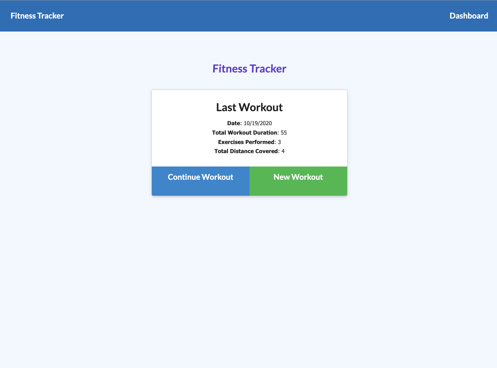
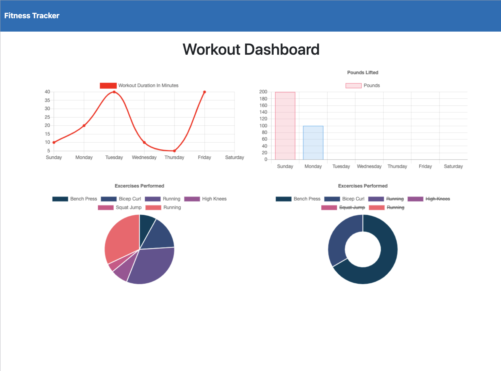

# Fitness Tracker


# Description

Fitness Tracker application to track the distance, duration, and exercises of a workout, using MongoDB, express routing, and Mongoose.

# Table of Contents

* [Installation](#installation)
* [Usage](#usage)
* [Technology](#technology)
* [Features](#features)
* [License](#license)
* [Contribution](#contribution)
* [Questions](#questions)

# Deployed Website: 
[Fitness Tracker](https://gauri-fitness-tracker.herokuapp.com/)

# Screenshot :

|Fitness Tracker Home Page| Workout Dashboard
|--|--
||


# User Story

```
As a user, I want to be able to view create and track daily workouts. 

I want to be able to log multiple exercises in a workout on a given day.

I should also be able to track the name, type, weight, sets, reps, and duration of exercise. 

If the exercise is a cardio exercise, I should be able to track my distance traveled.
```

# Business Context

```
A consumer will reach their fitness goals more quickly when they track their workout progress.
```

# Installation

1. Clone this repository to your local machine.

2. Run `npm install` to install dependencies required for this project.

3. Run `node server.js` to start the application.


# Usage

* Create a new workout or add to an existing workout.

* Choose workout type from resistance or cardio.

* Fill out exercise details and add it to ongoing workout or mark it complete.

* View your progress over time on the dashboard and current stats on the homepage.

# Technology

**1. [MongoDB](https://www.mongodb.com/)** :

* MongoDB is a general purpose, document-based, distributed database built for modern application developers and for the cloud era.

* MongoDB is a document database, which means it stores data in JSON-like documents.

**2. [Mongoose](https://mongoosejs.com/)** :

* MongoDB object modeling for node.js.

* Mongoose provides a straight-forward, schema-based solution to model your application data. It includes built-in type casting, validation, query building, business logic hooks and more.


**3. [Express.js](https://expressjs.com/)** :

* Web Applications : Express is a minimal and flexible Node.js web application framework that provides a robust set of features for web and mobile applications.

* APIs : With a myriad of HTTP utility methods and middleware, creating a robust API is quick and easy.

**4. [Node.js](https://nodejs.org/en/)** : 

* Node.js is an open-source and cross-platform JavaScript runtime environment. 

* A Node.js app is run in a single process, without creating a new thread for every request. 

# Features

1. NoSQL Database MongoDB is used to create database for this application.

2. Express server is used to handle routing.

3. Mongoose is used to create model schema.

4. User can track workout progress by different charts on dashboard.

5. Application is deployed to Heroku and MongoDB database is connected via MongoDB Atlas.

# License

This project is licensed under MIT License.

# Contribution

Please let me know how I can improve this project. Issues and pull requests are always welcome.

# Questions 

If you have any questions about the repo, 
contact me directly at [Email](mailto:khandkegauri@gmail.com).
